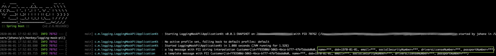

# Masking PII in Logs

Sample code accompanying [Masking PII In Logs](https://johanzietsman.com/masking-pii-in-logs/).

# Running the example

```
$ ./mvnw clean verify
$ java -jar target/logging-mask-pii-0.0.1-SNAPSHOT.jar
```


